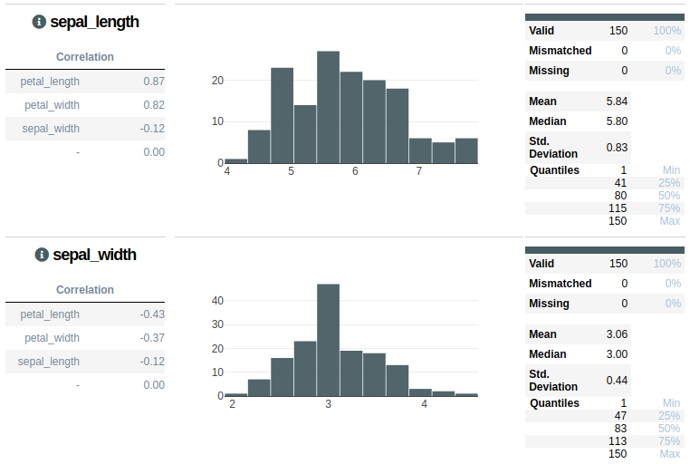

# DataCard

Kaggle-like dataset cards for pandas DataFrames.
[Check out the live version!](https://nbviewer.jupyter.org/github/ugallu/datacard/blob/master/DataCard.ipynb)




### Install
`!pip3 install git+https://github.com/ugallu/datacard#egg=datacard`
### Usage: 
```
import datacard
some_dataframe.datacard.plot()
```

Currently supported format: only numeric :(
